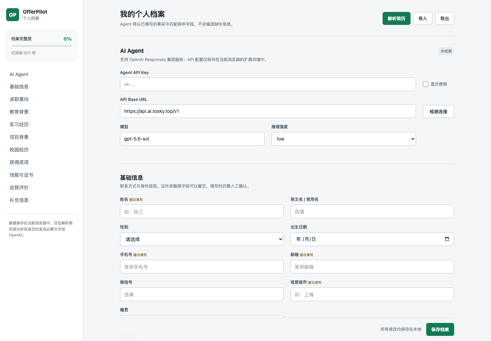

# OfferPilot Plugin

OfferPilot 是一个纯前端 Chrome 网申辅助扩展。它可以解析 PDF、DOCX、HTML 简历，生成结构化个人档案，再使用 OpenAI Responses API 将档案事实匹配到招聘表单，供用户确认后填写。

详细说明见：[插件介绍与使用指南](使用指南.md)。



## 核心能力

- PDF、DOCX、HTML/HTM 简历在浏览器内提取文字，不上传原始文件。
- 使用 Structured Outputs 将简历文字解析为结构化个人档案。
- 解析结果先预览，再以“只填空白字段、合并不重复经历”的方式写入档案。
- 识别招聘页字段并生成保守的填写计划。
- 已有值不覆盖，敏感或低置信度字段要求人工确认。
- 不点击提交、不同意协议、不操作招聘网站的附件上传控件。
- 独立维护论文标题、会议/期刊、作者列表与顺序、发表时间、收录分区、影响因子、DOI 和链接；个人网站与 GitHub 也有独立字段。
- 旧档案中混在“其他信息”的事实，可点击“用 Agent 整理其他信息”，预览后合并到论文等对应栏目；原文保留供核对。无需清空已有档案或重新上传 PDF。

## 表单适配与验证

填写规则位于 `extension/control-adapters.js`，执行器位于 `extension/form-engine.js`，由后台先于内容面板注入。详细控件族和参考模块见[控件能力对照](docs/control-parity.md)。

- Moka、北森、ATSX、Hotjob、飞书、智联的表单结构识别基础适配。
- Ant Design、Element、ATSX、iView、MTD、Kuma、Phoenix、Moka、飞书、智联、Brick 和 ARIA 选择控件：单选、多选、搜索、树、级联、弹窗和虚拟列表。
- 候选项先精确匹配，未命中时通过自己的 AI 通道匹配语义等价项；不接受候选集合外的返回值。
- 13 类日期预设：新旧 Ant、Element、iView、MTD、Kuma、Phoenix、Moka、飞书、ATSX、Brick、Fusion、MD；支持年月日、双列年月和日期区间，不补造缺失日期。
- 写入前保护已有值，页面重新渲染后重新定位；写入后等待稳定读回并检查可见错误、原生 validity 和 aria-invalid。后续字段导致前项变化时再次核验。
- 结果清单提供失败原因、字段定位、单项重试和重新扫描补填；有失败或未勾选建议时不执行计划中的保存动作。

这些适配在本地代表性 DOM 样本中验证，尚未完成各真实站点版本的回归。私有服务端未知规则、闭合 Shadow DOM、跨域 iframe 和没有可识别结构的自定义控件仍可能需要额外适配。读回通过表示当时页面状态稳定，不代表服务器已保存；保存按钮仍可见时会停止后续动作并提示检查。

运行浏览器回归：

```bash
npx playwright install chromium
npm run test:browser
```

更新扩展后，在 Chrome 扩展管理页重新加载 OfferPilot，再刷新招聘页面。

简历解析的长任务在受信任的扩展设置页直接运行同一套 Agent Harness，避免后台 Service Worker 消息通道中途关闭。解析期间保持设置页打开，不刷新或重新加载扩展；关闭页面会中断当前任务。失败进度保留在实际阶段，不显示为已完成 100%。招聘表单匹配仍由后台处理。

真实组件回归使用 React / Ant Design 和 Vue / Element Plus，校验组件内部的学校 ID、多选 ID、文本、日期及区间状态。测试报告输出至 `test-results/report.json`。这些依赖只用于开发测试，不打入扩展包。线上 99% 目标的固定分母和验收方式见 [验收基准](docs/acceptance-99.md)。

## 架构

```text
Chrome 扩展设置页
  ├─ PDF.js / Mammoth / DOMParser 提取简历文字
  ├─ chrome.storage.local 保存 API 设置和个人档案
  └─ 后台 Service Worker 调用 OpenAI Responses API

招聘页面内容脚本
  ├─ 提取字段标签、类型、候选项和当前值
  ├─ 通过后台 Agent 获取结构化匹配计划
  └─ 用户确认后填写，不自动提交
```

项目不再包含 Express 后端、`.env` 或本地端口配置。

## 安装

```bash
npm install
npm test
npm run check
npm run build:extension
```

然后在 Chrome 打开 `chrome://extensions/`，开启“开发者模式”，点击“加载已解压的扩展程序”，选择本项目的 `extension` 目录。

`npm run build:extension` 会在本地生成 `dist/offerpilot-plugin.zip`。Chrome 开发模式应加载 `extension` 目录，而不是直接选择 ZIP。

## 配置

打开 OfferPilot 的“扩展程序选项”，在“AI Agent”中填写：

- Agent API Key
- API Base URL，默认 `https://api.ai.tosky.top/v1`
- 模型，默认 `gpt-5.6-sol`
- 推理强度，默认 `low`

使用中转或兼容服务时，Base URL 应填写 API 版本根路径，例如 `https://gateway.example.com/openai/v1`，不要加 `/responses`。服务需要支持 `GET /models`、`POST /responses` 和 Structured Outputs。点击“检测连接”时，Chrome 会请求访问该 API 域名的权限。

API Key 不会被写入源码、导出档案或发送给招聘网页。

## 安全说明

API Key 和 Base URL 保存在当前 Chrome 配置文件的扩展本地存储中，并通过 `TRUSTED_CONTEXTS` 限制为扩展页面和后台读取。内容脚本无法直接读取存储，Agent 请求设置 `store: false`。

纯前端架构无法达到服务端密钥托管的隔离级别。此版本适合个人、本地、未公开分发的使用方式；如果要发布给多用户，应恢复受控服务端或改用短期令牌，不能把共享 API Key 打包进扩展。

## 目录

```text
extension/       Chrome MV3 扩展及浏览器端 Agent
extension/vendor PDF.js 与 Mammoth 浏览器构建
demo/            招聘表单演示页
examples/        示例结构化档案
scripts/         检查、依赖同步与打包脚本
test/            客户端 Agent、档案合并和解析测试
docs/images/     使用指南与 README 图片
dist/            本地构建产物（不提交到仓库）
```

## 开发命令

```bash
npm test
npm run check
npm run sync:vendor
npm run build:extension
```

`build:extension` 会先从锁定的 npm 依赖同步 PDF.js 和 Mammoth 浏览器文件，再生成 `dist/offerpilot-plugin.zip`。

## 官方 API 依据

- [Responses API](https://developers.openai.com/api/reference/responses/overview)
- [Structured Outputs](https://developers.openai.com/api/docs/guides/structured-outputs)
- [生产与 API Key 安全建议](https://developers.openai.com/api/docs/guides/production-best-practices)
