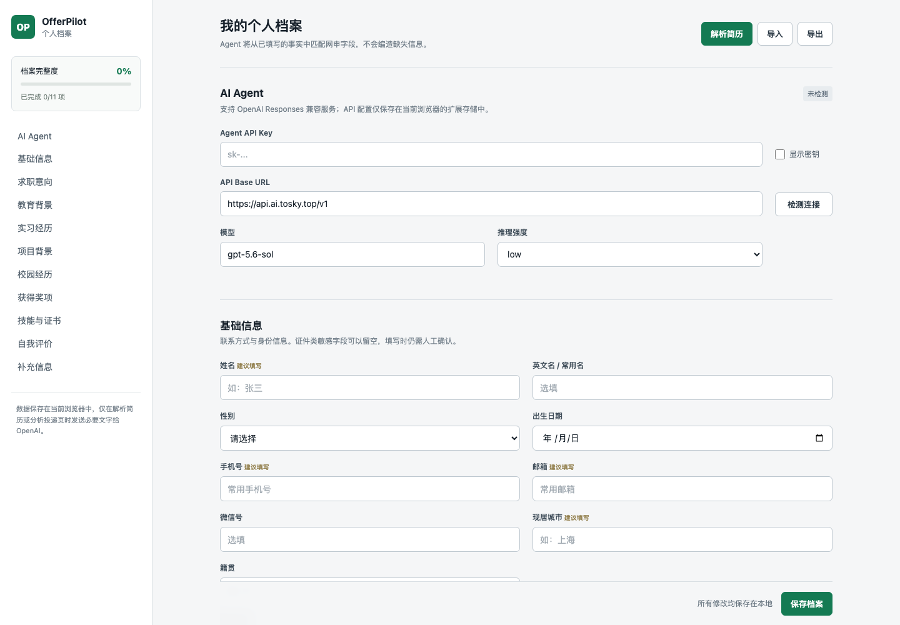
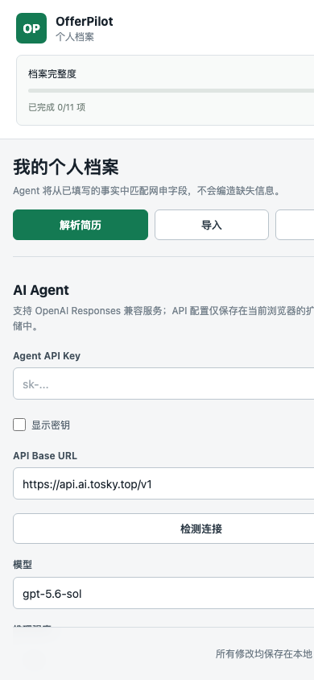

# OfferPilot Plugin 使用指南

OfferPilot 是一个开源的 Chrome 网申辅助扩展。它可以在浏览器内提取 PDF、DOCX、HTML 简历文字，生成结构化个人档案，并通过 OpenAI Responses 兼容服务将档案事实匹配到招聘表单。所有填写建议都需要用户确认，扩展不会自动提交申请。



<p align="center">
  
</p>

## 使用前准备

- Google Chrome 或其他支持 Manifest V3 的 Chromium 浏览器。
- OpenAI 或 Responses API 兼容服务提供的个人 API Key。
- 从 [GitHub 仓库](https://github.com/zlr930/OfferPilot-plugin) 下载的项目源码。

请勿使用已经在聊天、截图或源码中公开过的 API Key，也不要将共享 Key 写入扩展源码。

## 下载并安装

### 下载源码

任选一种方式：

1. 打开仓库首页，点击 **Code → Download ZIP**，下载后解压。
2. 使用 Git 克隆：

```bash
git clone https://github.com/zlr930/OfferPilot-plugin.git
cd OfferPilot-plugin
```

### 加载扩展

1. 在 Chrome 地址栏打开 `chrome://extensions/`。
2. 开启页面右上角的“开发者模式”。
3. 点击“加载已解压的扩展程序”。
4. 在刚下载或克隆的项目中选择 `extension` 文件夹。
5. 确认扩展列表中出现“OfferPilot”，可按需将它固定到浏览器工具栏。

更新源码后，在扩展卡片上点击“重新加载”。Chrome 开发者模式需要选择解压后的 `extension` 文件夹，不能直接加载 ZIP 文件。

## 配置 AI Agent

打开 OfferPilot 的“扩展程序选项”，填写以下配置：

1. **Agent API Key**：服务商提供的个人 Key，默认以密码形式遮罩。
2. **API Base URL**：默认 `https://api.ai.tosky.top/v1`。使用其他服务时填写其 API 版本根路径，不要包含末尾的 `/responses`。
3. **模型**：填写服务商实际支持的模型 ID，默认 `gpt-5.6-sol`。
4. **推理强度**：建议先使用 `low`；较高强度可能增加响应时间。
5. 点击“检测连接”，并在浏览器提示时允许扩展访问该 API 域名。
6. 点击“保存档案”。

当前版本要求服务实现 `GET /models`、`POST /responses` 和 Structured Outputs。仅支持 `/chat/completions` 的服务暂不兼容。

## 创建个人档案

可以直接填写基础信息、求职意向、教育、实习、项目、校园经历、奖项、技能证书和自我评价。输入停止约 1 秒后会自动保存，也可以点击“保存档案”。

- “导入”支持 OfferPilot JSON，以及写入补充信息的 TXT/Markdown 文件。
- “导出”生成结构化 JSON，不包含 API Key 和编辑器内部 ID。
- 证件号码、政治面貌、薪资等敏感信息可以留空。

## 上传并解析简历

1. 点击设置页右上角的“解析简历”。
2. 选择 PDF、DOCX、HTML 或 HTM 文件，文件大小不能超过 10 MB。
3. 等待本地文字提取和 Agent 结构化解析。
4. 检查姓名、联系方式、教育、实习、项目和技能等预览结果。
5. 点击“合并到档案”。已有字段不会被覆盖，相同经历只补充缺失内容。

原始简历文件只在浏览器内存中处理，不会直接上传；提取出的简历文字会发送到配置的 Agent API。简历解析最长等待 4 分钟，中转服务较慢时建议将推理强度设为 `low`。

扫描版 PDF 暂不支持 OCR。此类文件需要先转换成包含可选择文字的 PDF；旧版 `.doc` 文件应另存为 `.docx`。

## 辅助填写招聘表单

1. 登录招聘网站并进入简历编辑或申请表单。
2. 点击浏览器工具栏中的 OfferPilot。
3. 点击“分析当前页面”。
4. 检查每条建议的值、来源、置信度和确认状态。
5. 勾选正确项目，点击“应用选中”。
6. 最终检查页面，并由你手动保存、进入下一步或提交。

扩展只发送字段标签、类型、候选项和当前值，不发送整页 HTML。它不会覆盖已有值，也不会操作协议、声明、验证码、提交按钮或附件上传控件。

## 数据与安全

- 档案、API Key 和 Base URL 保存在当前浏览器配置文件的 `chrome.storage.local` 中。
- 存储访问限制为扩展受信任上下文，招聘网页无法直接读取 API Key。
- Agent 请求使用 Structured Outputs，并设置 `store: false`。
- 纯前端扩展无法提供服务端密钥托管级别的隔离，只适合使用用户自己的 API Key。
- 卸载扩展会删除本地档案和 API 设置，建议定期导出 JSON 备份。

## 常见问题

### 看不到“加载已解压的扩展程序”

确认当前页面是 `chrome://extensions/`，并已开启右上角“开发者模式”。选择目录时应进入解压后的项目并选择 `extension` 文件夹。

### 检测连接失败

检查 API Key、Base URL 和模型名称是否正确，并确认服务支持 `GET /models` 与 Responses API。Base URL 应包含服务要求的 `/v1` 等版本路径，但不能包含 `/responses`。

### 简历解析超时

将推理强度调整为 `low` 后重试，并确认 API 服务响应正常。特别长的简历会增加结构化解析时间。

### 某些字段没有匹配

常见原因是档案中缺少事实、招聘页面字段已有值、标签不清晰、候选项不兼容，或 Agent 置信度不足。不要为了提高匹配率编造信息。

### 可以自动上传招聘网站附件吗

不可以。“解析简历”只用于完善 OfferPilot 档案；招聘网站所需的简历、成绩单和证件照仍需手动上传。

## 开发与贡献

开发环境需要 Node.js 20 或更高版本：

```bash
npm install
npm test
npm run check
npm run build:extension
```

构建结果输出到 `dist/offerpilot-plugin.zip`。欢迎通过 [Issues](https://github.com/zlr930/OfferPilot-plugin/issues) 报告问题，或提交 Pull Request 改进项目。
